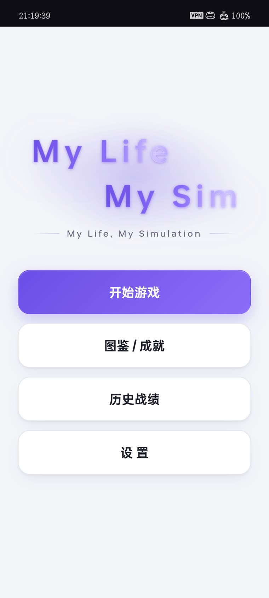
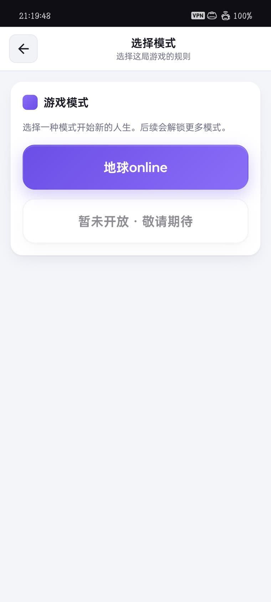
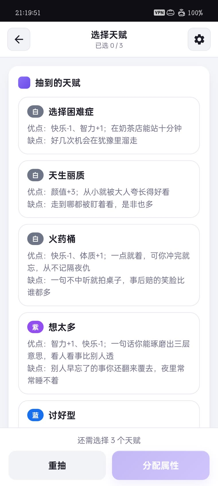
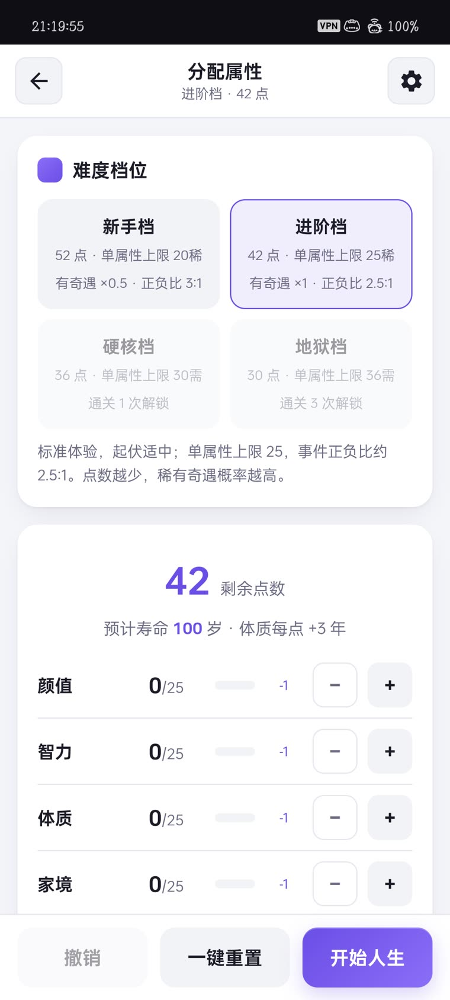
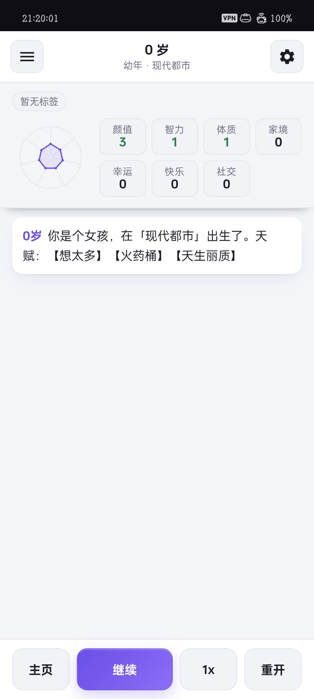
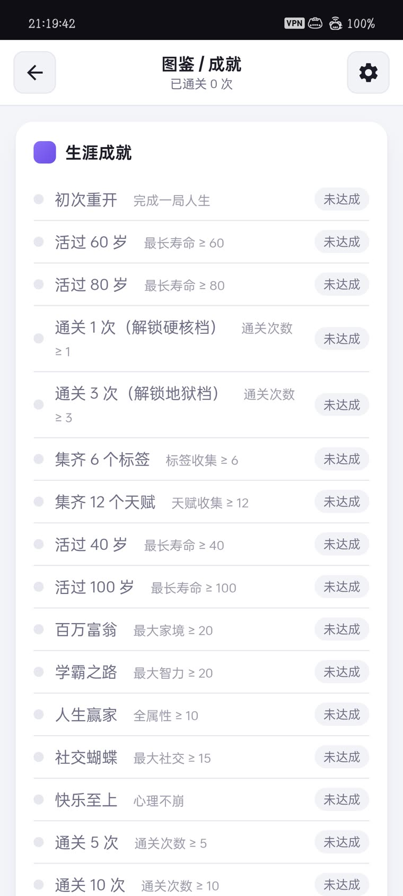
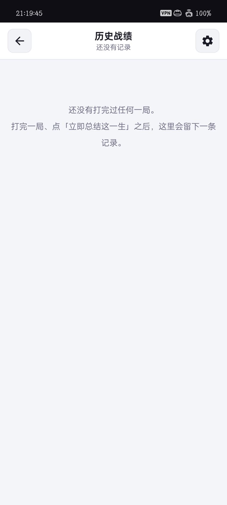
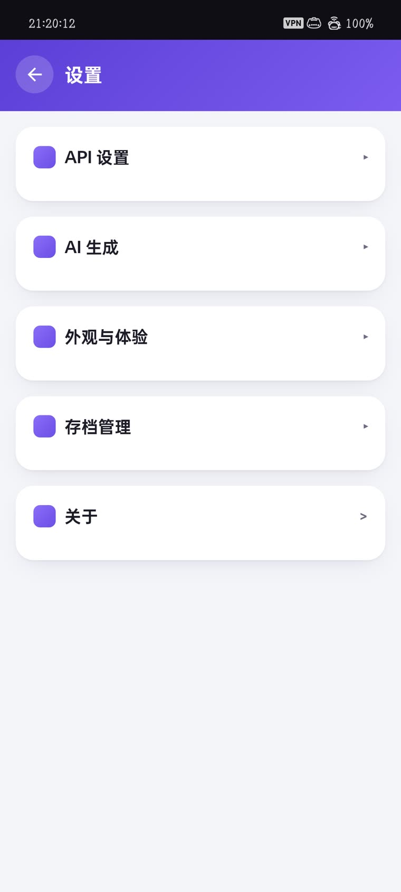

# 界面一览

> 以下截图为 Android 实机运行画面（深色关闭、跟随系统主题）。v0.0.4 只修 UI 缺陷与
> 数据正确性，界面结构未变，截图仍然对得上。

一局人生的完整动线：**主菜单 → 选择模式 → 抽天赋 → 分配属性 → 逐年推移 → 图鉴 / 成就 / 历史战绩**。

---

## 主菜单

`My Life` / `My Sim` 两行轻微错位的紫色艺术字，副标题 `—— My Life, My Simulation ——` 两侧带细横线。
四个入口自上而下：**开始游戏**（实心紫底主按钮）、图鉴 / 成就、历史战绩、设置。

---

## 选择模式

「游戏模式」卡片说明本局的规则来源。首发提供 **地球online**，
其余模式（`暂未开放 · 敬请期待`）为置灰禁用态，后续版本逐个解锁。

---

## 抽天赋

开局从天赋池抽 3 个词条，按稀有度用 **白 / 蓝 / 紫 / 橙** 圆点分色。
每条天赋都带明确数值，例如【白】天生丽质 `颜值 +3`、【白】火药桶 `快乐 -1、体质 +1`、【紫】想太多 `智力 +1、快乐 -1`。
不满意的整批可以「重抽」，也可以直接进下一步。

---

## 分配属性

四个难度档位各自决定 **初始点数 / 单项上限 / 奇遇倍率 / 正负事件比**：

| 档位 | 点数 | 上限 | 奇遇 | 正负比 | 解锁 |
|---|---|---|---|---|---|
| 新手档 | 52 | 20 | ×0.5 | 3 : 1 | 默认开放 |
| 进阶档 | 42 | 25 | ×1.0 | 2.5 : 1 | 默认开放 |
| 硬核档 | 36 | 30 | ×1.0 | 1.5 : 1 | 通关 1 次 |
| 地狱档 | 30 | 36 | ×1.0 | 1 : 1 | 通关 3 次 |

页面上大字显示剩余点数，并按「**体质每点 +3 年**」实时估算预计寿命。
属性条目支持逐项加减，底部可「撤销」单步或「一键重置」。

---

## 人生日志

推进页顶部是当前年龄与阶段（幼年 / 童年 / 少年 / 青年 / 中年 / 老年）加时代背景，
左侧属性雷达图配网格数值，正值绿色、负值红色。
中央逐年追加日志，起点就是这一生的第一句：

> 0岁 你是个女孩，在「现代都市」出生了。天赋：【想太多】【火药桶】【天生丽质】

底部一排控制：主页 / 继续（当前可点的高亮态） / 倍速 / 重开。

---

## 图鉴 · 生涯成就

顶部标明本机「已通关 N 次」，之下是生涯成就清单，未达成的统一置灰。
成就条件是结构化的（属性下限 / 标签数 / 通关次数 / 特定结局），
死亡后点「立即总结这一生」时才统一检测结算。

---

## 历史战绩

每打完一局都会在这里留一条记录，含享年、主导属性、评级与是否命中专属结局。
一局都没打完时显示空态引导：「打完一局、点『立即总结这一生』之后，这里会留下一条记录。」

---

## 设置

五项分组：**API 设置 / AI 生成 / 外观与体验 / 存档管理 / 关于**。
API Key 只保存在本机，游戏本体不内置任何密钥。
